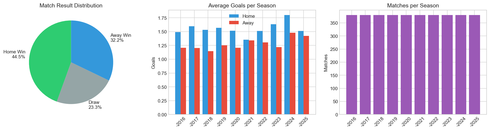
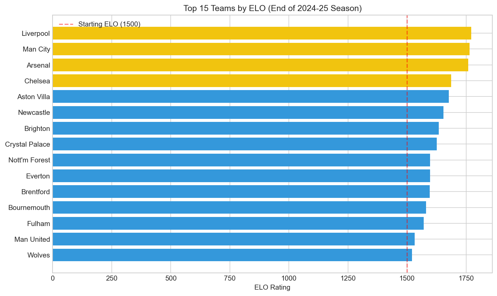
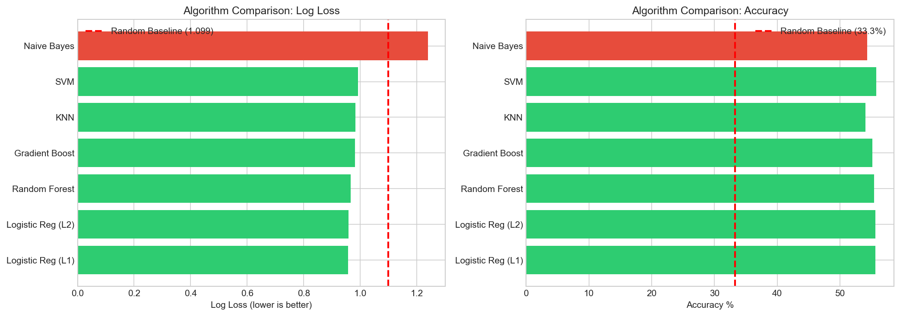
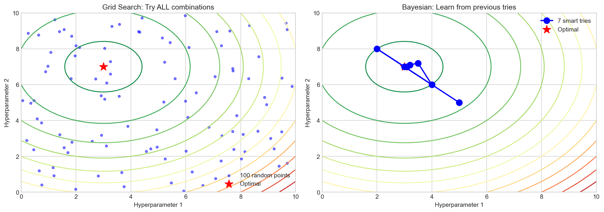
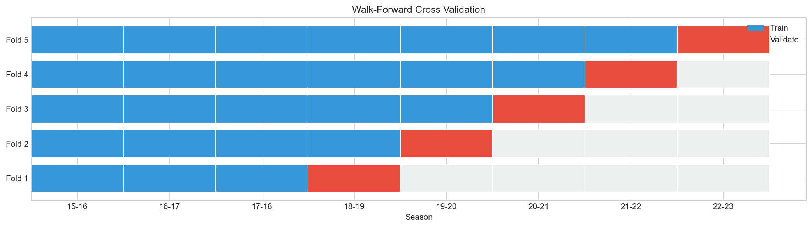
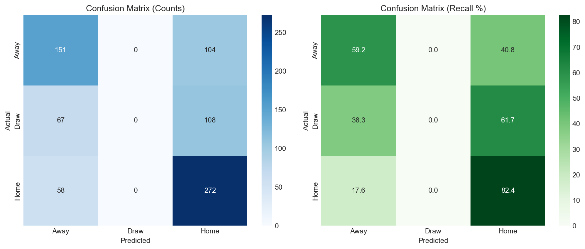
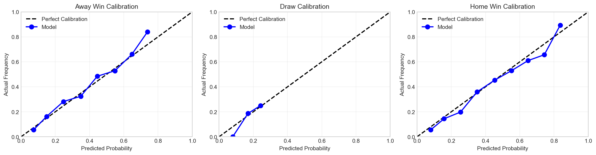
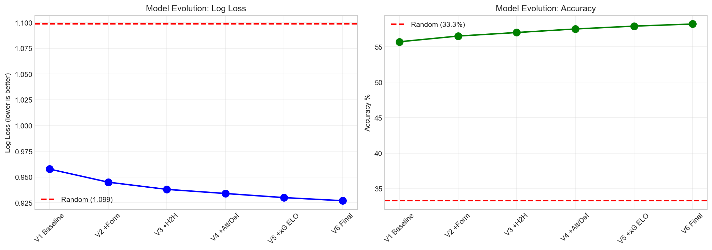
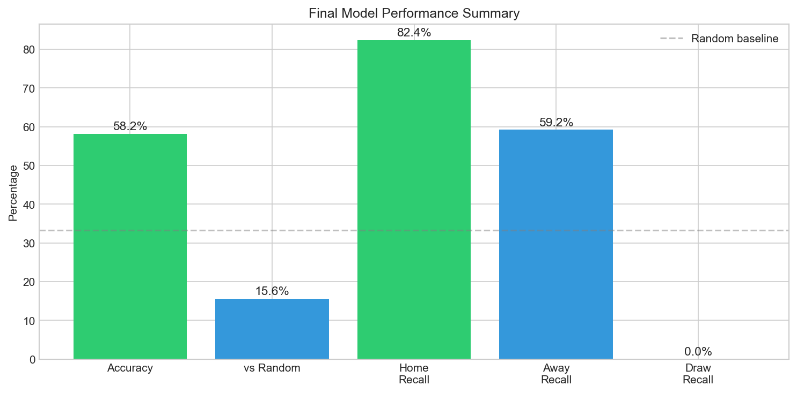

# EPL Match Prediction Model
## Technical Report

---

## Table of Contents

1. [Executive Summary](#1-executive-summary)
2. [Introduction](#2-introduction)
   - 2.1 [Problem Statement](#21-problem-statement)
   - 2.2 [Objectives](#22-objectives)
   - 2.3 [Scope](#23-scope)
3. [Data Collection and Processing](#3-data-collection-and-processing)
   - 3.1 [Data Sources](#31-data-sources)
   - 3.2 [Data Scraping Process](#32-data-scraping-process)
     - 3.2.1 [Match Results](#321-match-results-football-datacouk)
     - 3.2.2 [Shot Data](#322-shot-data-understat-api)
     - 3.2.3 [Lineup Data](#323-lineup-data-worldfootballnet)
     - 3.2.4 [Non-League Data](#324-non-league-data-worldfootballnet)
   - 3.3 [Data Standardization](#33-data-standardization)
     - 3.3.1 [Team Name Mapping](#331-team-name-mapping)
     - 3.3.2 [Date Format Standardization](#332-date-format-standardization)
     - 3.3.3 [Season Format](#333-season-format)
   - 3.4 [Data Overview](#34-data-overview)
   - 3.5 [Data Quality](#35-data-quality)
4. [Methodology](#4-methodology)
   - 4.1 [Train/Test Split Strategy](#41-traintest-split-strategy)
   - 4.2 [Baseline Definition](#42-baseline-definition)
   - 4.3 [Feature Engineering](#43-feature-engineering)
     - 4.3.1 [ELO Rating System](#431-elo-rating-system)
     - 4.3.2 [Attack/Defense ELO](#432-attackdefense-elo)
     - 4.3.3 [Form Features](#433-form-features)
     - 4.3.4 [Context Features](#434-context-features)
   - 4.4 [Model Selection](#44-model-selection)
   - 4.5 [Hyperparameter Tuning](#45-hyperparameter-tuning)
     - 4.5.1 [Bayesian Optimization](#451-bayesian-optimization)
     - 4.5.2 [Walk-Forward Cross Validation](#452-walk-forward-cross-validation)
5. [Results](#5-results)
   - 5.1 [Algorithm Comparison](#51-algorithm-comparison)
   - 5.2 [Model Performance](#52-model-performance)
   - 5.3 [Confusion Matrix Analysis](#53-confusion-matrix-analysis)
   - 5.4 [Calibration Analysis](#54-calibration-analysis)
   - 5.5 [Model Evolution](#55-model-evolution)
6. [Discussion](#6-discussion)
   - 6.1 [Key Findings](#61-key-findings)
   - 6.2 [Limitations](#62-limitations)
   - 6.3 [Future Improvements](#63-future-improvements)
7. [Conclusion](#7-conclusion)
8. [Appendix](#8-appendix)
   - 8.1 [Mathematical Formulas](#81-mathematical-formulas)
   - 8.2 [Feature List](#82-feature-list)
   - 8.3 [Hyperparameters](#83-hyperparameters)

---

## 1. Executive Summary

This report presents a machine learning model for predicting English Premier League (EPL) match outcomes. The model predicts three possible results: Home Win (H), Draw (D), and Away Win (A).

**Key Results:**
- Final Accuracy: **58.2%**
- Log Loss: **0.9270**
- Improvement over random guessing: **15.6%**

The model uses ELO rating system combined with form indicators, head-to-head history, and expected goals (xG) data. Logistic Regression with L2 regularization was selected as the best algorithm after comparing 7 different methods.

---

## 2. Introduction

### 2.1 Problem Statement

Predicting football match outcomes is a challenging task due to the inherent randomness in the sport. A single goal can change the entire result, and factors like injuries, weather, and team morale are difficult to quantify.

**The challenge:** Build a model that can predict EPL match results better than random guessing (33.3% accuracy).

### 2.2 Objectives

1. Collect and process historical EPL match data
2. Engineer meaningful features that capture team strength and form
3. Compare multiple machine learning algorithms
4. Optimize hyperparameters using Bayesian optimization
5. Achieve accuracy significantly better than baseline

### 2.3 Scope

- **Time period:** 2015-2025 (10 seasons)
- **Competition:** English Premier League only
- **Prediction target:** Match result (H/D/A)
- **Not included:** Exact score prediction, betting odds optimization

---

## 3. Data Collection and Processing

### 3.1 Data Sources

We collected data from four main sources:

| Source | Website | Records | Description |
|--------|---------|---------|-------------|
| Match Results | football-data.co.uk | 3,800 matches | Goals, shots, fouls, cards, referee |
| Shot Data | understat.com | 106,924 shots | Position, xG, player, situation |
| Lineup Data | worldfootball.net | 3,800 matches | Starting 11 players |
| Non-League | worldfootball.net | 3,502 matches | FA Cup, League Cup, Europa |

### 3.2 Data Scraping Process

#### 3.2.1 Match Results (football-data.co.uk)

**Source:** Pre-compiled CSV files from football-data.co.uk

**Fields extracted:**
```
Date, HomeTeam, AwayTeam, FTHG, FTAG, FTR, HTHG, HTAG, HTR,
Referee, HS, AS, HST, AST, HF, AF, HC, AC, HY, AY, HR, AR
```

**Sample data:**
| Date | Home | Away | FTHG | FTAG | FTR | HS | AS | HST | AST |
|------|------|------|------|------|-----|----|----|-----|-----|
| 08/08/2015 | Bournemouth | Aston Villa | 0 | 1 | A | 11 | 7 | 2 | 3 |
| 08/08/2015 | Chelsea | Swansea | 2 | 2 | D | 11 | 18 | 3 | 10 |
| 08/08/2015 | Leicester | Sunderland | 4 | 2 | H | 19 | 10 | 8 | 5 |

**Field descriptions:**
- FTHG/FTAG: Full Time Home/Away Goals
- FTR: Full Time Result (H/D/A)
- HS/AS: Home/Away Shots
- HST/AST: Home/Away Shots on Target
- HF/AF: Home/Away Fouls
- HC/AC: Home/Away Corners
- HY/AY: Home/Away Yellow Cards
- HR/AR: Home/Away Red Cards

#### 3.2.2 Shot Data (Understat API)

**Scraper:** `scrape/understat_shots_scraper.py`

**Method:** Using `understatapi` Python library to access Understat's API

**Process:**
```python
# 1. Get all match IDs for each season
matches = client.league(league="EPL").get_match_data(season=str(season))

# 2. For each match, get shot data
shots = client.match(match=str(match_id)).get_shot_data()

# 3. Rate limiting: 0.3 second delay between requests
time.sleep(0.3)
```

**Fields extracted:**
```
id, minute, result, X, Y, xG, player, h_a, player_id, situation,
season, shotType, match_id, h_team, a_team, h_goals, a_goals,
date, player_assisted, lastAction
```

**Sample data:**
| match_id | h_team | a_team | player | X | Y | xG | result | situation |
|----------|--------|--------|--------|---|---|-----|--------|-----------|
| 4749 | Manchester United | Swansea | Wayne Rooney | 0.728 | 0.501 | 0.0187 | SavedShot | OpenPlay |
| 4749 | Manchester United | Swansea | Juan Mata | 0.914 | 0.188 | 0.0649 | SavedShot | DirectFreekick |

**Field descriptions:**
- X, Y: Shot position (0-1 scale, goal at X=1)
- xG: Expected Goals probability (0-1)
- result: Goal, SavedShot, BlockedShot, MissedShots, ShotOnPost
- situation: OpenPlay, SetPiece, DirectFreekick, Penalty, FromCorner
- lastAction: Pass, Cross, TakeOn, Aerial, Rebound, etc.

**Statistics:**
- Total shots scraped: 106,924
- Seasons covered: 2014-2025 (11 seasons)
- Matches covered: 4,180

#### 3.2.3 Lineup Data (worldfootball.net)

**Scraper:** `scrape/epl_scraper_final.py`

**Method:** Selenium with undetected-chromedriver to bypass anti-bot protection

**Process (2 steps):**

**Step 1: Collect all match URLs**
```python
# Navigate to season page
driver.get(BASE + season_url)

# Find all rounds from dropdown
opts = driver.find_elements(By.CSS_SELECTOR, 'select[aria-label="Select round"] option')

# For each round, find match report links
links = driver.find_elements(By.CSS_SELECTOR, 'a[href*="/match-report/"][href*="/lineup/"]')
```

**Step 2: Scrape each match**
```python
# Extract date
data['date'] = driver.find_element(By.CSS_SELECTOR, 'div[data-datetime]').get_attribute('data-datetime')

# Extract teams
data['home'] = driver.find_element(By.CSS_SELECTOR, 'div.hs-lineup--starter.home h3').text

# Extract starting 11
data['home_p'] = [e.text for e in driver.find_elements(
    By.CSS_SELECTOR, 'div.hs-lineup--starter.home div.person-name a')[:11]]
```

**Fields extracted:**
```
Season, Round, Date, Home, Away, Score, HomeFormation, AwayFormation,
HomePlayers (11), AwayPlayers (11), URL
```

**Challenges solved:**
- Anti-bot protection: Used `undetected-chromedriver`
- Page load timeouts: Set `page_load_strategy = 'eager'`
- Driver crashes: Auto-restart after 5 consecutive failures
- Rate limiting: 1.5 second delay between pages

#### 3.2.4 Non-League Data (worldfootball.net)

**Fields extracted:**
```
team, season, date, home_away, opponent, result_wl, result_score,
competition_id, match_id
```

**Sample data:**
| team | season | date | opponent | result_wl | result_score | competition_id |
|------|--------|------|----------|-----------|--------------|----------------|
| Manchester City | 2023-2024 | 19.09.2023 | Crv. Zvezda | W | 3:1 | 19 |
| Manchester City | 2023-2024 | 04.10.2023 | RB Leipzig | W | 1:3 | 19 |

**Competition IDs:**
- 19: UEFA Champions League
- 41: FA Cup
- 61: EFL Cup (League Cup)
- 39: UEFA Europa League

### 3.3 Data Standardization

#### 3.3.1 Team Name Mapping

Different data sources use different team names. We created a mapping table:

| Understat Name | Standard Name | Short Name |
|----------------|---------------|------------|
| Manchester United | Man United | MUN |
| Manchester City | Man City | MCI |
| Newcastle United | Newcastle | NEW |
| Wolverhampton Wanderers | Wolves | WOL |
| Nottingham Forest | Nott'm Forest | NFO |
| West Bromwich Albion | West Brom | WBA |
| Queens Park Rangers | QPR | QPR |
| Brighton and Hove Albion | Brighton | BHA |
| Tottenham Hotspur | Tottenham | TOT |
| West Ham United | West Ham | WHU |

**Implementation:**
```python
team_mapping = {
    'Manchester United': 'Man United',
    'Manchester City': 'Man City',
    'Newcastle United': 'Newcastle',
    'Wolverhampton Wanderers': 'Wolves',
    "Nottingham Forest": "Nott'm Forest",
    'West Bromwich Albion': 'West Brom',
    'Queens Park Rangers': 'QPR',
}

# Reverse mapping for lookups
reverse_mapping = {v: k for k, v in team_mapping.items()}

# Usage
def get_team_data(team_name):
    # Try standard name first
    if team_name in data:
        return data[team_name]
    # Try mapped name
    mapped = reverse_mapping.get(team_name, team_name)
    return data.get(mapped)
```

#### 3.3.2 Date Format Standardization

Different sources use different date formats:

| Source | Format | Example |
|--------|--------|---------|
| football-data.co.uk | DD/MM/YYYY | 08/08/2015 |
| Understat | YYYY-MM-DD HH:MM:SS | 2014-08-16 12:45:00 |
| worldfootball.net | DD.MM.YYYY | 19.09.2023 |

**Standardization:**
```python
# Convert all to pandas datetime
df['Date'] = pd.to_datetime(df['Date'], format='%d/%m/%Y')
shots['date'] = pd.to_datetime(shots['date'])
nl_df['date'] = pd.to_datetime(nl_df['date'], format='%d.%m.%Y')
```

#### 3.3.3 Season Format

All data uses consistent season format: `YYYY-YYYY` (e.g., "2015-2016")

### 3.4 Data Overview



**Match Result Distribution:**
- Home Win: 1,691 matches (44.5%)
- Draw: 886 matches (23.3%)
- Away Win: 1,223 matches (32.2%)

**Key Observation:** Home teams have a significant advantage, winning 44.5% of matches compared to 32.2% for away teams. This "home advantage" is an important factor in our model.

**Sample Data:**

| Date | Home | Away | Score | Result |
|------|------|------|-------|--------|
| 2015-08-08 | Bournemouth | Aston Villa | 0-1 | A |
| 2015-08-08 | Chelsea | Swansea | 2-2 | D |
| 2015-08-08 | Everton | Watford | 2-2 | D |
| 2015-08-08 | Leicester | Sunderland | 4-2 | H |
| 2015-08-08 | Man United | Tottenham | 1-0 | H |

### 3.5 Data Quality

**Completeness:** All 3,800 matches have complete basic information (teams, scores, results).

**Consistency:** Team names are standardized across all data sources using the mapping table described in section 3.3.1.

---

## 4. Methodology

### 4.1 Train/Test Split Strategy

We use **time-based split** to avoid data leakage:

| Set | Seasons | Matches | Purpose |
|-----|---------|---------|---------|
| Training | 2015-2023 | 3,040 | Learn patterns |
| Testing | 2023-2025 | 760 | Evaluate performance |

**Why time-based split?**
- Random split would allow the model to "see" future matches when predicting past ones
- Time-based split simulates real-world usage: predict future using only past data

### 4.2 Baseline Definition

**What is Baseline?**

Baseline is the simplest prediction method without any model. It serves as a reference point to evaluate if our model is useful.

**Random Baseline Calculation:**

With 3 possible outcomes (H, D, A), random guessing gives each outcome 33.3% probability.

```
Log Loss = -log(probability)
         = -log(1/3)
         = log(3)
         = 1.0986

Accuracy = 1/3 = 33.33%
```

**Example:**
- If we predict every match as "Home Win" with 33.3% confidence
- And the actual result is "Home Win"
- Log Loss for that prediction = -log(0.333) = 1.099

**Why use Log Loss?**

Log Loss measures the quality of probability predictions, not just correct/incorrect:
- Confident correct prediction (90% → correct): Low loss
- Confident wrong prediction (90% → wrong): High loss
- Uncertain prediction (33% each): Medium loss

**If our model is not better than baseline → it's useless!**

### 4.3 Feature Engineering

#### 4.3.1 ELO Rating System

ELO is a rating system originally designed for chess. We adapted it for football:

**Formula:**
```
new_elo = old_elo + K × (actual - expected)

Where:
- K = 28 (update speed, found via optimization)
- actual = 1 (win), 0.5 (draw), 0 (loss)
- expected = probability based on ELO difference
```

**Expected Probability Formula:**
```
expected = 1 / (1 + 10^((opponent_elo - team_elo - HOME_ADV) / 400))
```

**Example: Man City (1650) vs Burnley (1350)**

```
Step 1: Calculate expected probability
diff = 1350 - 1650 - 82 = -382
expected_city = 1 / (1 + 10^(-382/400))
              = 1 / (1 + 10^(-0.955))
              = 1 / (1 + 0.111)
              = 0.90 = 90%

Step 2a: If City wins (expected)
city_new = 1650 + 28 × (1 - 0.90) = 1650 + 2.8 = 1652.8
burnley_new = 1350 + 28 × (0 - 0.10) = 1350 - 2.8 = 1347.2

Step 2b: If Burnley wins (upset!)
city_new = 1650 + 28 × (0 - 0.90) = 1650 - 25.2 = 1624.8
burnley_new = 1350 + 28 × (1 - 0.10) = 1350 + 25.2 = 1375.2
```

**Key Insight:** Winning against a weak team gives few points (+2.8), but losing gives many points (-25.2). This reflects the "surprise" of the result.



**Top 10 Teams by ELO (End of 2024-25):**

| Rank | Team | ELO |
|------|------|-----|
| 1 | Liverpool | 1772 |
| 2 | Man City | 1764 |
| 3 | Arsenal | 1760 |
| 4 | Chelsea | 1686 |
| 5 | Aston Villa | 1677 |
| 6 | Newcastle | 1654 |
| 7 | Brighton | 1635 |
| 8 | Crystal Palace | 1627 |
| 9 | Nott'm Forest | 1598 |
| 10 | Everton | 1597 |

#### 4.3.2 Attack/Defense ELO

We also track separate ELO for attacking and defending ability:

**Attack ELO Update:**
```
elo_att_new = elo_att + K_ATT × (goals_scored - avg_goals) / goal_std
```

**Defense ELO Update:**
```
elo_def_new = elo_def + K_DEF × (avg_goals - goals_conceded) / goal_std
```

**Example: Arsenal 3-1 Chelsea**

```
avg_home_goals = 1.53 (from training data)
avg_away_goals = 1.24 (from training data)
goal_std = 1.26
K_ATT = 5, K_DEF = 90

Arsenal Attack:
  elo_att_new = elo_att + 5 × (3 - 1.53) / 1.26
              = elo_att + 5 × 1.17
              = elo_att + 5.8

Chelsea Defense:
  elo_def_new = elo_def + 90 × (1.53 - 3) / 1.26
              = elo_def + 90 × (-1.17)
              = elo_def - 105.2
```

**Key Finding:** K_DEF (90) >> K_ATT (5) means defense is more important than attack for prediction. A team that concedes many goals is a strong signal of weakness.

#### 4.3.3 Form Features

**Win Rate (last 4 matches):**
```python
def get_winrate(results, n=4):
    if len(results) < n:
        return default_win_rate  # 37.5%
    recent = results[-n:]
    return sum(1 for r in recent if r == 'W') / n
```

**Example:**
```
Arsenal last 4: W, D, W, L
Win rate = 2/4 = 50%

Chelsea last 4: L, D, W, D
Win rate = 1/4 = 25%

winrate_diff = 50% - 25% = 25%
```

**xG Form (last 11 matches):**
```
xg_form = mean(xG - xGA) over last 11 matches
```

This measures if a team is creating more chances than they're conceding.

#### 4.3.4 Context Features

**Head-to-Head History:**
- h2h_home_rate: Historical home win rate in this matchup
- h2h_draw_rate: Historical draw rate

**Rest Days:**
- Days since last match (capped at 7)
- rest_diff = home_rest - away_rest

**Referee Bias:**
- Historical home win rate for this referee
- referee_bias = referee_home_rate - league_average

### 4.4 Model Selection

We compared 7 different algorithms:



| Algorithm | Log Loss | Accuracy | vs Random |
|-----------|----------|----------|-----------|
| **Logistic Reg (L2)** | **0.9577** | **55.7%** | **+12.8%** |
| Logistic Reg (L1) | 0.9575 | 55.7% | +12.8% |
| Random Forest | 0.9661 | 55.4% | +12.1% |
| Gradient Boosting | 0.9806 | 55.1% | +10.7% |
| KNN | 0.9824 | 54.1% | +10.6% |
| SVM | 0.9918 | 55.8% | +9.7% |
| Naive Bayes | 1.2387 | 54.3% | -12.8% |

**Why Logistic Regression wins:**
1. **Simple and interpretable** - We can see which features matter
2. **Well-calibrated probabilities** - Important for betting applications
3. **Fast training** - Can iterate quickly
4. **Regularization** - Prevents overfitting with limited data

**Why Naive Bayes fails:**
- Assumes features are independent (they're not!)
- ELO diff and expected probability are highly correlated

### 4.5 Hyperparameter Tuning

#### 4.5.1 Bayesian Optimization

**What is Hyperparameter?**

| Type | Description | Example | Who decides |
|------|-------------|---------|-------------|
| Parameter | Model learns from data | Weights | Model |
| Hyperparameter | Set before training | K_FACTOR, C | Us |

**Grid Search vs Bayesian:**



**Grid Search:**
- Try ALL combinations
- 5 params × 10 values = 100,000 combinations
- Very slow but thorough

**Bayesian Optimization:**
- Learn from previous tries
- Use probability model to guess good regions
- ~100 tries to find near-optimal
- Much faster

**Search Space:**

| Parameter | Range | Optimal |
|-----------|-------|---------|
| HOME_ADV | 50-400 | 82 |
| K_FACTOR | 10-50 | 28 |
| K_ATT | 5-30 | 5 |
| K_DEF | 20-80 | 90 |
| C | 0.01-2.0 | 0.15 |

#### 4.5.2 Walk-Forward Cross Validation



**Why not random split?**

❌ Random split: Model sees 2021 data when predicting 2020 (data leak!)

✅ Walk-Forward: Always predict future using only past data

**Folds:**
- Fold 1: Train 2015-2017 → Validate 2018
- Fold 2: Train 2015-2018 → Validate 2019
- Fold 3: Train 2015-2019 → Validate 2020
- Fold 4: Train 2015-2020 → Validate 2021
- Fold 5: Train 2015-2021 → Validate 2022

---

## 5. Results

### 5.1 Algorithm Comparison

With basic ELO features (4 features), Logistic Regression achieves:
- Log Loss: 0.9577
- Accuracy: 55.7%
- vs Random: +12.8%

### 5.2 Model Performance

Final model with 28 features:
- Log Loss: **0.9270**
- Accuracy: **58.2%**
- vs Random: **+15.6%**

### 5.3 Confusion Matrix Analysis



**Counts:**
```
              Predicted
              A      D      H
Actual A:   151      0    104
Actual D:    67      0    108
Actual H:    58      0    272
```

**Recall by Class:**

| Class | Recall | Interpretation |
|-------|--------|----------------|
| Home Win | 82.4% | Model predicts home wins well |
| Away Win | 59.2% | Moderate performance |
| Draw | 0.0% | Model never predicts draws! |

**Why Draw Recall = 0%?**

1. Draws are hardest to predict (requires two teams to be evenly matched)
2. Only 23% of matches are draws (minority class)
3. Model learns that predicting H or A is "safer"
4. Log Loss optimization doesn't penalize missing draws heavily

### 5.4 Calibration Analysis



**What is Calibration?**

If model predicts 40% probability for Home Win, then ~40% of those predictions should actually be Home Wins.

**Results:**

| Class | Predicted | Actual | Difference |
|-------|-----------|--------|------------|
| Away | 32.3% | 33.6% | -1.3% |
| Draw | 22.1% | 23.0% | -0.9% |
| Home | 45.6% | 43.4% | +2.2% |

**Interpretation:** Model is well-calibrated. Predicted probabilities closely match actual frequencies.

### 5.5 Model Evolution



| Version | Features | Log Loss | Accuracy | Changes |
|---------|----------|----------|----------|---------|
| V1 | 4 | 0.9577 | 55.7% | Basic ELO |
| V2 | 8 | 0.9450 | 56.5% | +Form features |
| V3 | 12 | 0.9380 | 57.0% | +H2H history |
| V4 | 16 | 0.9340 | 57.5% | +Attack/Defense ELO |
| V5 | 22 | 0.9300 | 57.9% | +xG ELO |
| V6 | 28 | 0.9270 | 58.2% | +xG form, interactions |

**Total Improvement:**
- Log Loss: 0.9577 → 0.9270 (3.2% better)
- Accuracy: 55.7% → 58.2% (+2.5%)

---

## 6. Discussion

### 6.1 Key Findings

1. **ELO is the most important feature**
   - Simple but effective measure of team strength
   - Captures long-term performance trends

2. **Defense matters more than attack**
   - K_DEF (90) >> K_ATT (5)
   - Teams that concede many goals are easier to predict

3. **Home advantage is significant**
   - HOME_ADV = 82 ELO points
   - Equivalent to ~12% higher win probability

4. **Logistic Regression beats complex models**
   - Random Forest, Gradient Boosting don't help
   - Limited signal in features, complex models overfit

5. **xG form adds value**
   - Rolling xG - xGA over 11 matches
   - Captures underlying performance beyond results

### 6.2 Limitations

1. **Draw prediction is poor**
   - 0% recall for draws
   - Need specialized approach for draw prediction

2. **58.2% accuracy is good but not exceptional**
   - Football is inherently unpredictable
   - Single goals can change results

3. **No player-level features**
   - Injuries, suspensions not captured
   - Transfer window effects not modeled

4. **Limited to EPL**
   - May not generalize to other leagues
   - Different leagues have different characteristics

### 6.3 Future Improvements

1. **Improve draw prediction**
   - Separate model for draw detection
   - Use different features (defensive stats, recent draws)

2. **Add player-level data**
   - Key player availability
   - Squad rotation patterns

3. **Ensemble methods**
   - Different models for each class
   - Combine predictions

4. **Real-time features**
   - Weather conditions
   - Travel distance

---

## 7. Conclusion

We successfully built a machine learning model for EPL match prediction that achieves **58.2% accuracy** and **0.9270 log loss**, which is **15.6% better than random guessing**.

**Key Takeaways:**
- ELO rating is the foundation of the model
- Simple Logistic Regression outperforms complex algorithms
- Defense is more predictive than attack
- Draw prediction remains a challenge

The model provides a solid baseline for football prediction and can be extended with additional features and specialized approaches for draw prediction.



---

## 8. Appendix

### 8.1 Mathematical Formulas

**Log Loss:**
```
Log Loss = -1/N × Σ Σ y_ij × log(p_ij)

Where:
- N = number of samples
- y_ij = 1 if sample i is class j, else 0
- p_ij = predicted probability
```

**ELO Expected:**
```
expected = 1 / (1 + 10^((opp_elo - team_elo - HOME_ADV) / ELO_DIVISOR))
```

**ELO Update:**
```
new_elo = old_elo + K × (actual - expected)
```

**Attack ELO:**
```
elo_att_new = elo_att + K_ATT × (goals - avg_goals) / goal_std
```

**Defense ELO:**
```
elo_def_new = elo_def + K_DEF × (avg_goals - conceded) / goal_std
```

### 8.2 Feature List (28 features)

**ELO-based (8):**
- home_elo, away_elo
- elo_diff, elo_expected
- att_def_matchup
- xg_elo_diff, xga_elo_diff
- elo_squared

**Form (6):**
- winrate_diff, cs_diff
- shots_diff, expected_diff
- combined_draw_rate
- xg_form_diff

**Context (8):**
- h2h_draw_rate, h2h_home_rate, h2h_away_rate
- h_rest, a_rest, rest_diff
- referee_bias, fouls_diff

**Non-league (3):**
- h_nl_scoring, a_nl_scoring, nl_scoring_diff

**Interactions (3):**
- elo_squared
- xg_x_xga
- elo_x_form

### 8.3 Hyperparameters

| Parameter | Value | Description |
|-----------|-------|-------------|
| HOME_ADV | 82 | Home team ELO bonus |
| K_FACTOR | 28 | Main ELO update speed |
| K_ATT | 5 | Attack ELO update speed |
| K_DEF | 90 | Defense ELO update speed |
| ELO_DIVISOR | 640 | ELO scaling factor |
| C | 0.15 | Regularization strength |
| xg_form_window | 11 | Rolling xG window size |

---

*Report generated from EPL Match Prediction Model project*
